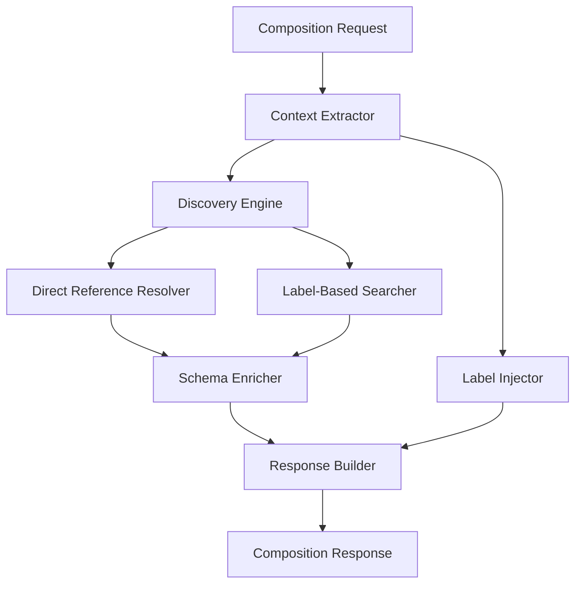

# 🏗️ **KubeCore Schema Registry v2.0 - Go Implementation**

## **📋 Executive Summary**

A **Crossplane Composition Function** written in Go that provides intelligent platform context discovery and relationship mapping for the KubeCore platform. The function uses a **label-based ownership model** to efficiently discover transitive relationships between platform resources, enabling compositions to make informed decisions based on the complete resource graph.

---

## **🎯 Core Purpose**

Enable Crossplane compositions to discover and understand relationships between platform resources (GitHubProject → KubeCluster → KubEnv → App) through intelligent label-based traversal, providing rich context for resource generation and configuration.

---

## **🏛️ High-Level Architecture**



---

## **🔧 Key Responsibilities**

### **1. Context Extraction & Analysis**
**Responsibility**: Extract and interpret the request context from Crossplane compositions
- Parse composite resource metadata and spec
- Extract `enableTransitiveDiscovery` flag from multiple possible locations
- Identify the requesting resource type and its references
- Determine traversal requirements (forward/reverse/both)

**Input**: Crossplane RunFunctionRequest
**Output**: Structured context with discovery parameters

---

### **2. Label Injection System**
**Responsibility**: Inject ownership labels into resources during composition
- Calculate direct parent relationships from `*Ref` fields
- Resolve transitive parent relationships through reference chain
- Apply standardized labels (`<resourcetype>.kubecore.io/name`)
- Maintain label consistency across resource updates

**Labels to Inject**:
```yaml
githubproject.kubecore.io/name: <project-name>
kubecluster.kubecore.io/name: <cluster-name>
kubenv.kubecore.io/name: <env-name>
kubecore.io/ownership-chain: "project:cluster:env"
```

---

### **3. Discovery Engine**
**Responsibility**: Discover related resources using hybrid approach

#### **3.1 Direct Reference Resolution** (Forward Traversal)
- Parse `*Ref` fields from resource specs
- Directly GET referenced resources by name/namespace
- Handle optional references gracefully
- Support array references (e.g., `qualityGateRefs`)

#### **3.2 Label-Based Discovery** (Reverse Traversal)
- Query resources using label selectors
- Leverage etcd indexing for O(1) performance
- Support multi-level transitive queries
- Handle cross-namespace discovery

---

### **4. Schema Registry & Validation**
**Responsibility**: Manage and validate resource schemas
- Load and cache CRD OpenAPI schemas
- Validate resource relationships
- Provide schema information for composition decisions
- Detect and validate `*Ref` field patterns

---

### **5. Relationship Mapper**
**Responsibility**: Build and maintain resource relationship graph
- Map parent-child relationships
- Identify peer relationships
- Calculate relationship paths
- Detect circular dependencies

---

### **6. Query Processing**
**Responsibility**: Process complex context queries
- Support multiple query types (by type, by label, by reference)
- Handle pagination for large result sets
- Apply filters and selectors
- Optimize query execution plans

---

### **7. Response Generation**
**Responsibility**: Build structured responses for compositions
- Format platform context according to specification
- Include discovered schemas with metadata
- Provide relationship information
- Generate insights and recommendations

---

### **8. Performance Optimization**
**Responsibility**: Ensure function operates efficiently
- Cache frequently accessed resources
- Implement connection pooling for K8s API
- Parallel processing for multiple discoveries
- Circuit breaker for API failures

---

### **9. Observability & Monitoring**
**Responsibility**: Provide operational visibility
- Structured logging with trace IDs
- Metrics for discovery performance
- Error tracking and reporting
- Debug mode for troubleshooting

---

## **📦 Component Breakdown for Agent Specialization**

### **Agent 1: Core Function & Context Handler**
- Main function setup and gRPC server
- Context extraction logic
- Request/response handling
- Error management

### **Agent 2: Label Management System**
- Label injection algorithms
- Label standardization
- Ownership chain calculation
- Label validation

### **Agent 3: Discovery Engine**
- Direct reference resolver
- Label-based searcher
- Traversal strategies
- Result aggregation

### **Agent 4: Kubernetes Client & API**
- K8s client wrapper
- Resource CRUD operations
- Label selector queries
- Watch/event handling

### **Agent 5: Schema & Validation**
- CRD schema loading
- OpenAPI validation
- Reference field detection
- Schema caching

### **Agent 6: Performance & Caching**
- Cache implementation
- Connection pooling
- Parallel processing
- Circuit breaker

### **Agent 7: Testing & Quality**
- Unit tests
- Integration tests
- Performance benchmarks
- Test fixtures

---

## **🔌 Key Interfaces**

```go
// Core interfaces that all agents must implement/use

type DiscoveryEngine interface {
    DiscoverForward(ctx context.Context, resource Resource) ([]Resource, error)
    DiscoverReverse(ctx context.Context, resource Resource) ([]Resource, error)
    DiscoverTransitive(ctx context.Context, resource Resource, depth int) ([]Resource, error)
}

type LabelInjector interface {
    InjectOwnershipLabels(resource *Resource, context *Context) error
    CalculateOwnershipChain(resource Resource) ([]string, error)
}

type SchemaRegistry interface {
    GetSchema(apiVersion, kind string) (*Schema, error)
    ExtractRefFields(schema *Schema) ([]string, error)
    ValidateResource(resource Resource) error
}

type ResponseBuilder interface {
    BuildPlatformContext(resources []Resource, query Query) (*PlatformContext, error)
    GenerateInsights(context *PlatformContext) ([]Insight, error)
}
```

---

## **📊 Success Metrics**

1. **Performance**: Discovery completes in <100ms for 3-hop traversal
2. **Accuracy**: 100% of relationships discovered correctly
3. **Reliability**: 99.9% uptime with circuit breaker protection
4. **Efficiency**: Single-digit API calls per discovery operation
5. **Scalability**: Handles 1000+ resources without degradation

---

## **🚀 Implementation Priorities**

1. **Phase 1**: Core function with context extraction
2. **Phase 2**: Label injection system
3. **Phase 3**: Basic discovery (forward refs only)
4. **Phase 4**: Label-based reverse discovery
5. **Phase 5**: Performance optimization
6. **Phase 6**: Advanced features (insights, recommendations)

---

This specification provides clear boundaries for agent specialization while maintaining a cohesive overall architecture. Each agent can focus on its specific domain while adhering to the defined interfaces.